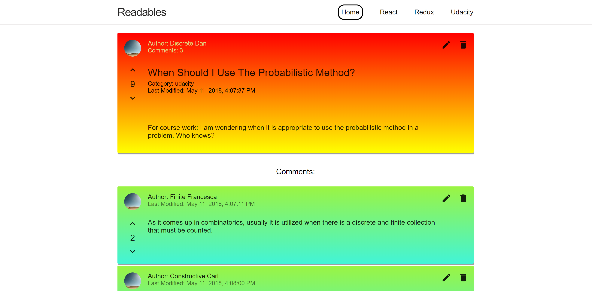
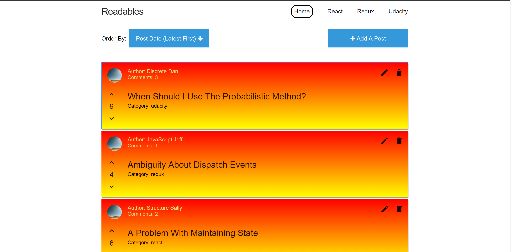
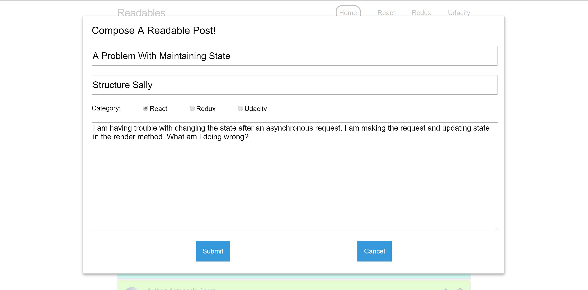

# Readables

    
    

        GitHub repository: <a target="\_blank" href="https://github.com/wbchristerson/reactnd-project-readable-starter">https://github.com/wbchristerson/reactnd-project-readable-starter</a>
    

This project is a forum (content/comment) application in which users may post content to predefined categories, comment on their posts and other users' posts, and vote on posts and comments. The backend server for storing information was provided by Udacity. I made the rest of the application using <code>create-react-app</code> along with React and Redux.

    
Structure

     
    <ul>
        <li>On all pages of the application there is a navigation bar listing the name of the application as well as the different post categories. Clicking on a post category will lead the user to a page listing all posts of that category.</li>
        <li>The project opens with a main page listing all currently published posts. There are options at the top of the page for the order of presentation of posts, by date of latest modification as well as by net number of votes. There are also options for composing a new post, with a button that opens a modal for such creation.</li>
        <li>Clicking on any post takes the user to a page for that particular post, listing its data as well as all additional comments.</li>
        <li>Each post itself has a sample avatar image, a title, and content. Content is only visible on the specific post page (not in the main list view). In addition, there are options to edit a post as well as to delete it. Selecting editing will open a modal similar to the composition modal. On the far left side of each post there are also buttons for increasing and decreasing the vote count for a particular post.</li>
        <li>Comments have similar display styles.</li>
    </ul>

    
Design

     
    A view of a sample main page with posts sorted by latest modification:

     

    

        
    

    A view of a sample page for a specific post together with its associated comments:

    

        
    

    A sample edit modal for a post:

    

        
    

    
Running The Application

     
    To download, you can clone the repository using this terminal command:
     
    <code>git clone https://github.com/wbchristerson/reactnd-project-readable-starter</code>
     
     

    Alternatively, follow the instructions below to download to a hard drive:

    <ul>
        <li>Navigate to <a href="https://github.com/wbchristerson/reactnd-project-readable-starter" target="\_blank">this page</a>.</li>
        <li>Click the green "Clone or download" button towards the right then choose "Download ZIP".</li>
        <li>Find the folder <code>reactnd-project-readable-starter-master</code> in your Downloads folder or wherever it was placed on your device.</li>
        <li>Right click and choose "Extract All".</li>
    </ul>

    To run the application, you will need to have <code>npm</code> installed. See <a href="https://www.npmjs.com/get-npm" target="\_blank">here</a> for installation information. Upon downloading both <code>npm</code> and the project directory, install all dependencies for the API server and execute it from the command line in the project directory by running the following commands in the terminal:
     
    <code>
        cd api-server
         
        npm install
         
        node server
    </code>
     
     

    In another terminal window, run the following commands for the front-end from within the project directory:

     
    <code>
        cd frontend
         
        npm start
    </code>

     
     
    A browser window will open with the project's main page.

    

