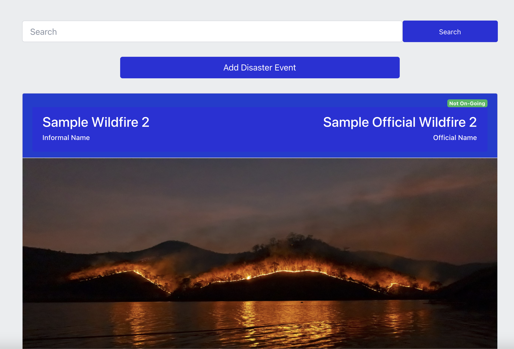

# Hello!

This website showcases some projects that I have created in various programming languages. I am currently working as a software engineer at <a href="https://www.bloomberg.com/company/" target="\_blank">Bloomberg LP</a>.

<!-- For the past year and a half, I have been working as a software engineer at the educational technology start-up <a href="https://101edu.co" target="\_blank">101 Edu</a>, dealing mostly with front-end development on web and mobile platforms but also with some exposure to server-side architecture. I am interested in discrete math, computer science, and applications of statistics and probability in finance. Lately, I have also been trying to learn more about machine learning with data analysis technologies like Numpy, Pandas, and TensorFlow. -->

[Here](https://github.com/wbchristerson) is my GitHub account and [here](https://www.linkedin.com/in/william-christerson/) is my LinkedIn page.

## Projects

    

        <a href="./DisasterReporter">
            

                
            

            <h2 style="margin-top: 0px">Disaster Reporter Site</h2>
            

                A fullstack application to provide an interface for users to create witness reports of natural disasters.
            

            <h4>Python ⚬ SQLAlchemy ⚬ PostreSQL ⚬ React</h4>
        </a>
    

    

        <a href="/FlowerClassifier">
            

                
            

            <h2 style="margin-top: 0px">NN Flower Classifier</h2>
            

                A command line application to train and run a neural network to identify flower species based on previous image data.
            

            <h4>Python ⚬ Jupyter Notebook ⚬ PyTorch</h4>
        </a>
    

    

        <a href="/MaximumMatchings">
            

                
            

            <h2 style="margin-top: 0px">Maximum Matchings</h2>
            

                An interactive application to demonstrate a classic algorithm for determining maximum matchings in bipartite graphs.
            

            <h4>Python</h4>
        </a>
    

    

        <a href="/NeighborhoodMap">
            

                
            

            <h2 style="margin-top: 0px">Neighborhood Map</h2>
            

                A map application providing information about local restaurants, stores, and other venues in Manhattan Beach, California.
            

            <h4>React ⚬ CSS ⚬ Google Maps API</h4>
        </a>
    

    

        <a href="/MobileFlashcards">
            

                
            

            <h2 style="margin-top: 0px">Mobile Flashcards</h2>
            

                An Android mobile application for creating flashcard decks and then quizzing yourself on your decks.
            

            <h4>React Native</h4>
        </a>
    

    

        <a href="/Readables">
            

                
            

            <h2 style="margin-top: 0px">Readables</h2>
            

                A basic forum and posting application allowing comments, voting, editing, and topic differentiation.
            

            <h4>React ⚬ Redux ⚬ CSS</h4>
        </a>
    

    

        <a href="/MyReads">
            

                
            

            <h2 style="margin-top: 0px">My Reads</h2>
            

                A book-tracking application listing the books currently in a user's library together with a large collection of available books to search for.
            

            <h4>React</h4>
        </a>
    

    

        <a href="/MathematicalDatabase">
            

                
            

            <h2 style="margin-top: 0px">Mathematical Database</h2>
            

                A small-scale interactive database storing solutions to challenging mathematical puzzles and problems drawn from various sources.
            

            <h4>Python</h4>
        </a>
    

    

        <a href="/Frogger">
            

                
            

            <h2 style="margin-top: 0px">Frogger</h2>
            

                A re-creation of the classic arcade game Frogger.
            

            <h4>
              JavaScript ⚬ HTML ⚬ CSS
            </h4>
        </a>
    

    

        <a href="/MatchingGame">
            

                
            

            <h2 style="margin-top: 0px">Matching Game</h2>
            

                A memory challenge for users to match hidden cards in a timed setting.
            

            <h4>
              JavaScript (jQuery) ⚬ HTML ⚬ CSS
            </h4>
        </a>
    

    

        <a href="/PixelArt">
            

                
            

            <h2 style="margin-top: 0px">Pixel Art Maker</h2>
            

                An application to make colorful pixel images of varying grid sizes using an extensive color palette.
            

            <h4>
              JavaScript (jQuery) ⚬ HTML ⚬ CSS
            </h4>
        </a>
    

## Attribution

This website was created using <a href="https://www.mkdocs.org/" target="\_blank">MkDocs</a> and <a href="https://squidfunk.github.io/mkdocs-material/" target="\_blank">Material for MkDocs</a>

## Project layout

    mkdocs.yml    # The configuration file.
    docs/
        index.md  # The documentation homepage.
        ...       # Other markdown pages, images and other files.
